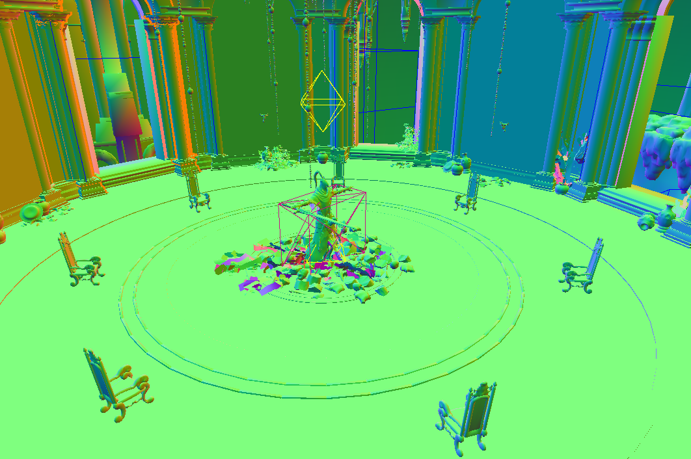

# Projects Crossing Boundaries

## The Ring of Night
> Pushing the boundaries of Elden Ring

The Ring of Night is my long-term mod for Elden Ring. It introduces various mechanics that were previously not in the game, like sprints, wall jumps, climbing and a grappling hook. To make acquiring these skills more meaningful I designed a multi-stage in-game event with two entirely new areas, a ported boss and additional features that required unlocking some previously hardcoded mechanics.

## LED bracelet
> Animated glowing bracelet for dance performances

Meant for light-based dance performances, this wristband can be programmed to match a song beat by beat. This is done using a subtitle file which encodes the timings, patterns and colors. Patterns include fades, rotations, blinking, oscillations, blurs and more.

