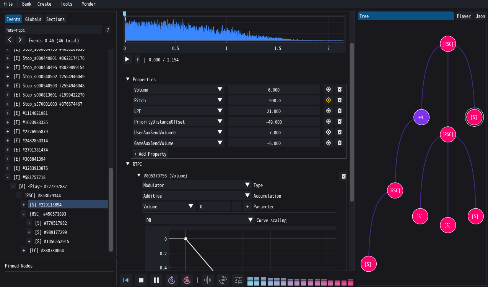
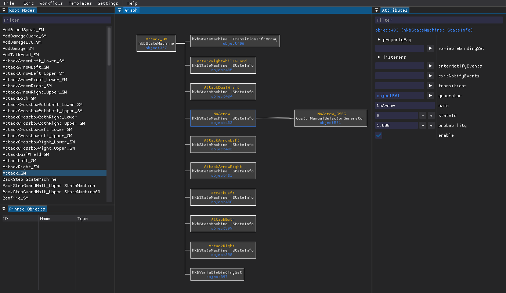
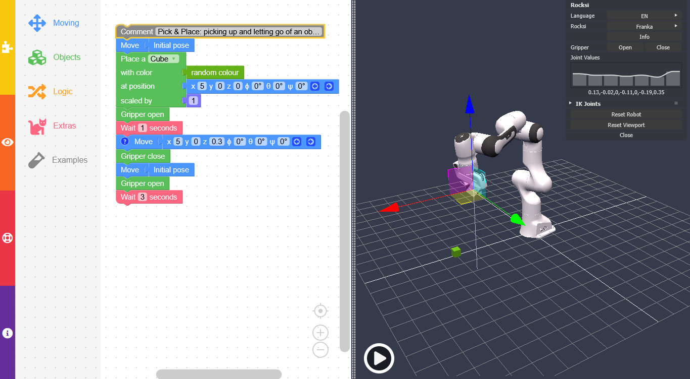

# Software

I love programming, maybe a bit too much. There is a structure in the way things work, and expressing these in clean code is just as enjoyable as designing the user experience around it. If I do something I want to do it right.
{ .annotate }

1. The nicest ones are below, and the rest you can find on [github](https://github.com/ndahn/)

## better_launch
> A full replacement for the ROS2 launch system

The standard ROS2 launch system has many downsides, such as indeterminism, unreliable process termination, and an overall poor user experience. Better launch is a complete replacement for the entire launch system that either fixes or improves all of the vanilla system's faults, and adds many new (convenience) features on top of it.

```python
from better_launch import BetterLaunch, launch_this

@launch_this(ui=True)
def my_main(enable_x: bool = True):
    """
    This is how nice your launch files could be!
    """
    bl = BetterLaunch()

    if enable_x:
        bl.node(
            "examples_rclpy_minimal_publisher",
            "publisher_local_function",
            "example_publisher",
        )

    # Include other launch files, even regular ROS2 launch files!
    bl.include("better_launch", "ros2_turtlesim.launch.py")
```

```bash
$> bl my_package my_launch_file.py --enable_x True
```

[https://dfki-ric.github.io/better_launch/](https://dfki-ric.github.io/better_launch/)


## Yonder
> Graphical editor for Wwise soundbanks

Wwise soundbanks are used in many modern games and contain complex tree structures controlling how audio clips are played back (timing, mixing, filters, effects, etc.). Yonder is a free tool for exploring and editing these soundbanks. It's also capable of simulating a major part of the audio playback.



[https://ndahn.github.io/yonder/](https://ndahn.github.io/yonder/)


## HkbEditor
> Graphical editor for Havok animation graphs

Havok uses "behavior" state machines to control animation parametrization, playback, blending and more. HkbEditor can visualize and edit these behaviors and provides a plugin-system for storing more complex edits in single-unit script files.



[https://ndahn.github.io/HkbEditor/](https://ndahn.github.io/HkbEditor/)


## Rocksi
> Web-based 3d robot simulator for education

Robotics is interesting, but most schools struggle to provide enough robots for even a fraction of a single classroom. Rocksi was written as a low-entry-barrier solution to allow students to learn programming a simulated robot without having access to a physical one. The programs can also be exported to the real systems where needed.



[https://ndahn.github.io/rocksi/](https://ndahn.github.io/Rocksi/)
