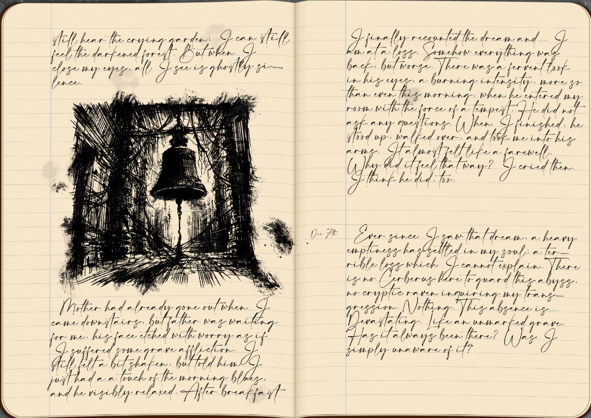
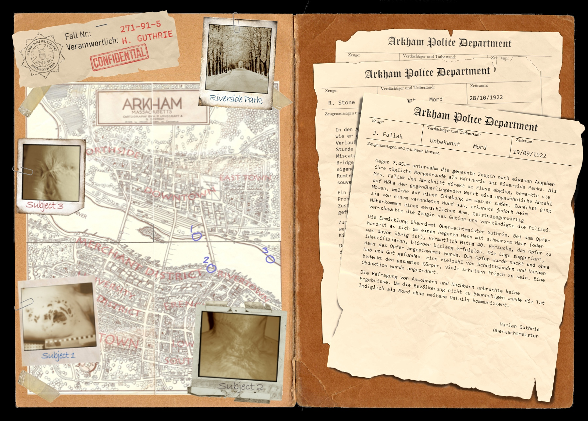
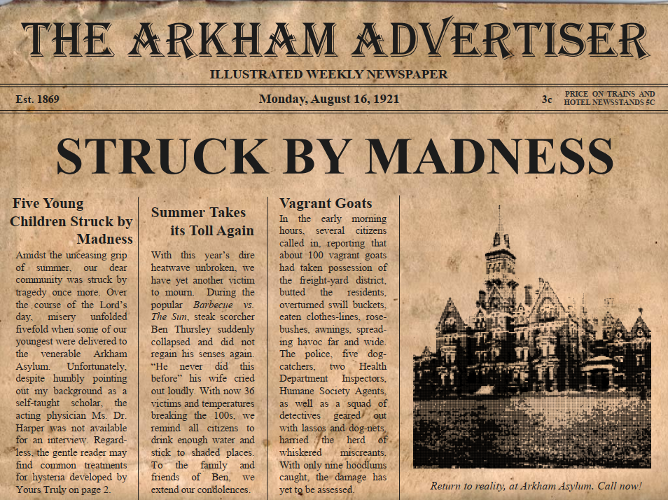
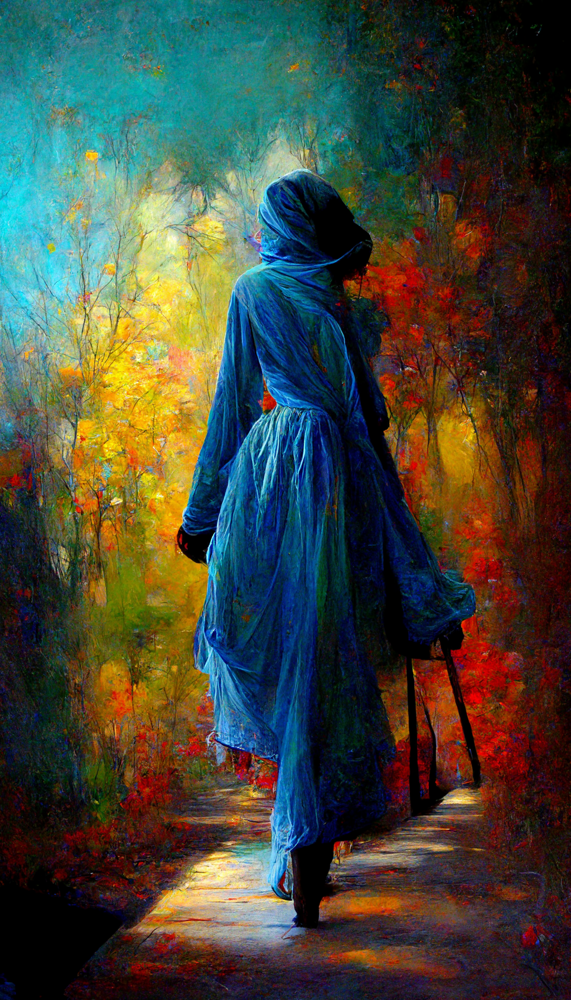

# Stories

> In girum imus nocte et consumimur igni

1. We spin into the night as the fire consumes us

A veil so thin it might as well not exist. Do we merely pretend we don't notice? And if we changed our minds, what would we find moving beneath? I want to make it tangible. Allow me to guide you, for but a moment...

## Pen & Paper
> Custom scenarios for Call of Cthulhu of different lengths, with many an asset and puzzles to solve

### The Uncaring Dark
Even before she approached him, he could feel it: a feverish unrest that seemed to boil up inside his chest, an uncanny concoction of excitement, dread, and something he couldn’t quite put his finger on. “May I sit for a while?” Her voice was like smoke on the half frozen river, an innocent cue of the ravaging fire that gave birth to it. “Ma’am.” There were plenty of empty benches nearby, but he didn't mind the company. He even swept some snow away for her to sit. She accepted with a thin smile that couldn't quite hide her troubled looks, her otherwise pretty face marred by sleepless nights. “Can I help you somehow?” For a moment he thought she didn’t hear his question. “Help…” she finally echoed. There was... something in her voice, a distant chime as if the cold, empty sky itself was ringing with every word she spoke. Vertigo washed over him, forcing him against the ice-crusted backrest to suppress the sudden sensation. When his vision cleared up again, her pained eyes were right in front of his, two dying stars in an endless abyss. “Help me...” Her echoes unending. “Help me.” A stillness of thoughts. “HELP ME!”  - The Uncaring Dark.

### A Locksmith's Secret
From the safety of the railing you watch several ice floes floating across the river, their unyielding pace betraying the muted surface. Foam and debris crawl between them, forming a labyrinthine spiderweb with your boat at its center, your sullen pace barely enough to escape the tangle. You blink. Among the rubble drifts a bloated corpse, barren and naked, its blueish skin covered in countless scars. Slowly, as if with tremendous effort, it turns in the unseen currents, revealing a pained face and broken eyes that are not quite empty. A whisper rises from the half-open jaw, rises like smoke from a dying fire, a thousand voices regorging back into the stygian depths until but a single one remains: "You shouldn't have come here."

### Daymares
Our minds are feeble things, and thus the madness of the young is of particular concern. When five children are suddenly struck with a collective bout of madness you find yourselves confronted with an impossible question:  What will you risk for a broken mind?

## Short Stories
> Dozens of short stories I wrote, playing in the fictional universe of *A Flower and a Stone*

She's standing on the edge of the precipice, a posture that seems to embrace the falling night. A red gleam shimmers in her eyes; from without or within you cannot tell. She opens her mouth to speak a word, but the wind tears it away. Maybe she spoke the wind. It was not meant for us and so we remain silent. The large foxwolf next to her nuzzles his nose inside her hand and she gently caresses the familiar features. Pale hands running through brown and white and black fur, evoking a deep reverberating purr. Transfixed I follow her slender fingers, trying to trace the endless swirls and patterns covering her body without ever repeating themselves. There is no path to follow; every line, every turn, every knot is of equal importance, and yet they leave no choice but onwards.
There is that rare moment that everybody knows yet no one has every experienced consciously; the moment of crossing the border of sleep. A moment of freely falling. A moment of forgetting the world. A moment of eternity.
I shake my head to break the spell and she gives me a cautioning look. A sad yet grateful smile crosses her face, and I struggle to decipher the impression. The moment passes and she turns back to the horizon. Shadows have swept over the valley far beneath and we know we are soon to follow. As we watch the last hint of dawn slowly disperse, you once again turn your eyes towards the stars. Glowing lines and circles stretch before your knowing mind, a great plan to explain it all if only we could reach that far. Yet there is no doubt: it all leads here.
It ends with her.

## The Rain That Never Came
> Memories of a final journey

I traveled beside you, until I no longer could.

